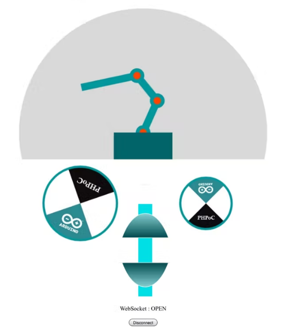

# M3-SM-IOT

## Robot Arm Controoler Via Web

### Requirements: 

<ul>
  <li><a href="https://store.arduino.cc/products/arduino-uno-rev3/" target="_blank">Arduino Uno Rev3</a></li>
  <li><a href="https://www.phpoc.com/phpoc_wifi_shield.php" target="_blank">PHPoC WiFi Shield for Arduino</a></li>
  <li><a href="https://www.amazon.com/6DOF-Robot-Arm/s?k=6DOF+Robot+Arm" target="_blank">6DOF Arm Robot</a></li>
</ul>

### Source Code : 
Source code inlude two files:
<ul>
 <li>Robot_Arm.ino: Arduino code.</li>
 <li>Arm_Controler.php: Web app code, which is uploaded to PHPoC WiFi Shield or PHPoC Shield.</li>
</ul>
You also need to upload the image file flywheel.png to PHPoC Shield.

### Page Design: 

